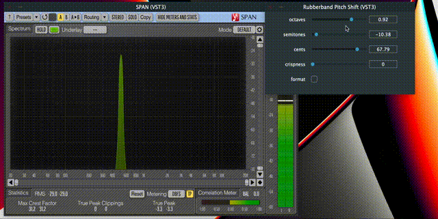

# Overview
A Pitch shifter plugin implementation using [JUCE](https://github.com/juce-framework/JUCE) and [rubberband](https://github.com/breakfastquay/rubberband)


# How to build
1. Download [JUCE](https://github.com/juce-framework/JUCE) source code
2. Set `JUCE_SOURCE_DIR` to your JUCE source directory in CMakeLists.txt line 5
3. Run cmake config & build
    ```bash
    cmake -S . -B build
    cmake --build build
    ```
4. After build, you can find vst3 plugin in `build/plugin/VST3`